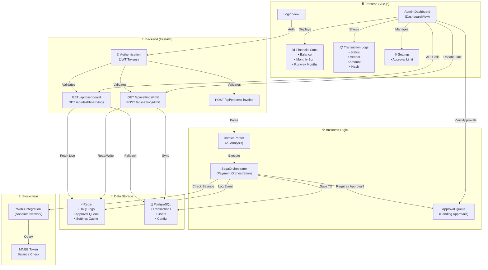
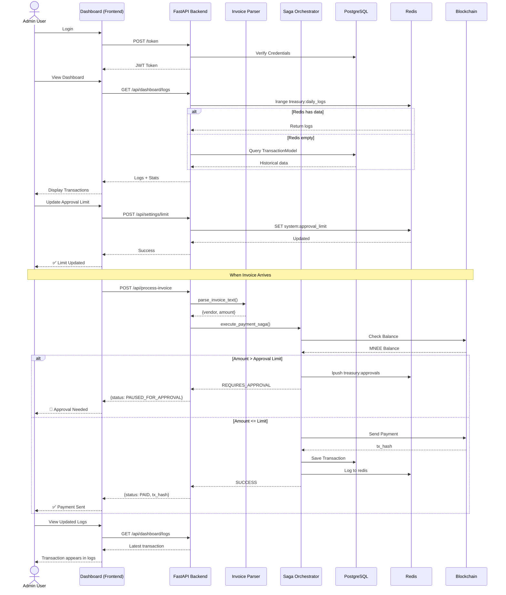
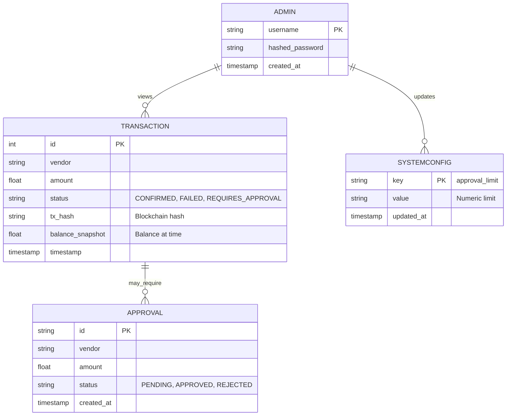

# Autonomous Treasurer - System Architecture

## Admin Dashboard Architecture

## Transaction Flow with Admin Dashboard

## Admin Dashboard Data Model

## API Endpoints for Admin Dashboard

| Endpoint | Method | Auth | Purpose |
|----------|--------|------|---------|
| `/` | GET | ❌ | Health check |
| `/token` | POST | ❌ | Login (get JWT) |
| `/api/dashboard` | GET | ✅ | Get treasury stats |
| `/api/dashboard/logs` | GET | ✅ | View transaction history |
| `/api/settings/limit` | GET | ✅ | Get approval limit |
| `/api/settings/limit` | POST | ✅ | Update approval limit |
| `/api/process-invoice` | POST | ✅ | Submit invoice for processing |

