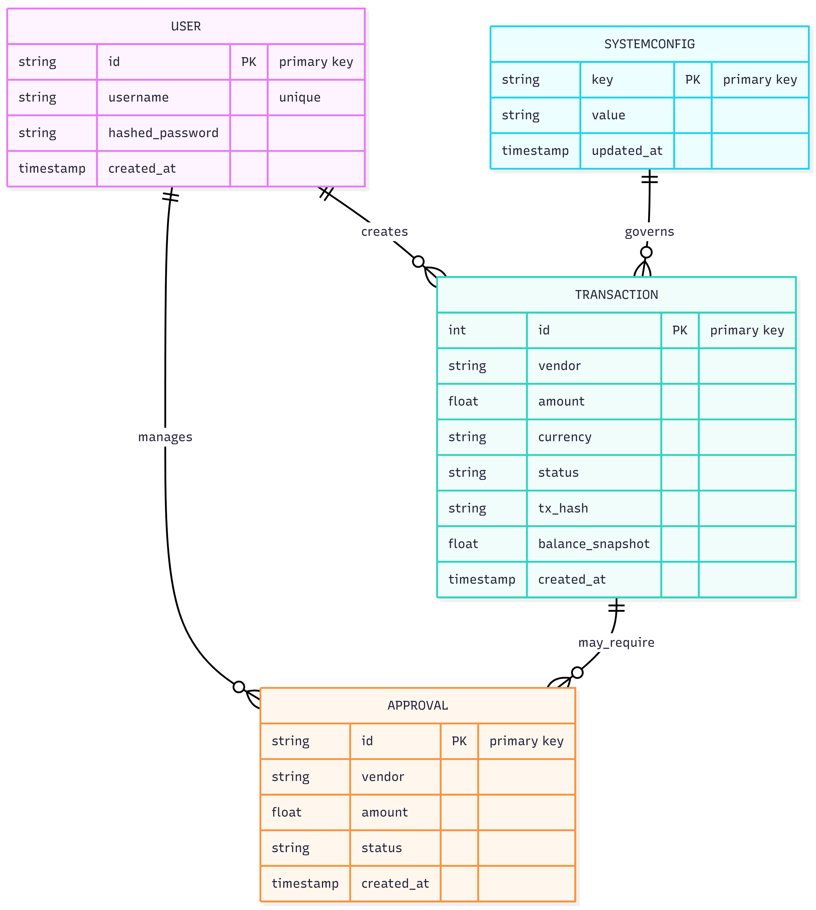

# 🏦 The Autonomous Treasurer  
******AI-Driven Financial Runway Protection on Soneium******

***   ***

***## 🚨 The Problem***  
***DAO treasuries and freelance wallets are bleeding.***  
**** **Human Error:** Founders accidentally double-pay invoices.***  
**** **No Oversight:** "Death by a thousand cuts" via small, unapproved transactions.***  
**** **Slow Operations:** Manual multi-sig approvals take days, slowing down operations.***

***## 🛡️ The Solution***  
*****The Autonomous Treasurer** is an intelligent financial guardrail that sits between your invoices and your wallet. It doesn't just automate payments; it **enforces policy**.***

**** **🤖 AI Perception:** Parses raw invoice text/PDFs to extract vendors and amounts.***  
**** **🧠 Logic Engine:** Checks current runway, burn rate, and approval policies in real-time.***  
**** **⚡ Soneium Speed:** Executes micro-transactions instantly on the Minato network via **MNEE Stablecoin**.***  
**** **🔒 CFO Controls:** A secured Admin Dashboard to dynamically adjust spending limits without code changes.***

***---***

***## 🏗️ Architecture***

***### **High-Level System Flow*****  
***This flow represents the "Safety Path" when an invoice exceeds the policy limit:***

***`Invoice` -> `Check (Policy)` -> `Fail (Pause)` -> `Log (Redis/DB)` -> `Dashboard` -> `Notify (Email)`***

***### **Detailed System Diagram*****


*The system uses a **Saga Orchestration Pattern**...*

***### **Data Model*****
To ensure auditability, the system uses a hybrid storage approach. While Redis handles high-speed state, PostgreSQL maintains a permanent, relational record of every financial decision.



* **Transactions:** Stores the immutable history of every payment attempts, including the blockchain `tx_hash` and the `balance_snapshot` at that moment.
* **SystemConfig:** Allows dynamic policy adjustments (e.g., changing the approval limit from $50 to $500) without redeploying code.

***### **Detailed Logic*****  
***The system uses a **Saga Orchestration Pattern** to ensure financial safety. It treats "Financial Reliability" as a first-class citizen, ensuring no funds are lost between the off-chain decision and on-chain settlement.***

***```mermaid***  
***graph TD***  
    ***A[Invoice Received] -->|AI Parser| B(Extract Data)***  
    ***B --> C{Policy Check}***  
    ***C -->|Amount < Limit| D[✅ Auto-Pay on Soneium]***  
    ***C -->|Amount > Limit| E[🛑 Pause (Fail Safe)]***  
    ***E --> G[Log to Redis/DB]***  
    ***G --> H[Update Dashboard]***  
    ***H --> I[Notify Admin via Email]***  
    ***D --> G***

### **Tech Stack**

* **Orchestrator:** Python 3.11 + FastAPI  
* **Frontend:** Vue.js + TailwindCSS (Dark Mode Terminal UI)  
* **State Management:** Redis (Message Queue & Caching)  
* **Ledger:** PostgreSQL (Double-entry logging)  
* **AI:** OpenAI GPT-4o (Invoice Reasoning)  
* **Blockchain:** Web3.py + Soneium Minato RPC

<details>  
<summary><strong>📂 View Project Structure (Click to Expand)</strong></summary>

Bash

autonomous-treasurer/  
├── backend/  
│   ├── agents/  
│   │   ├── invoice_parser.py    # LangChain: Extracts $ amount & vendor  
│   │   └── budget_manager.py    # Logic: Checks "Runway" vs "Spend"  
│   ├── finance/  
│   │   ├── mnee_wallet.py       # Web3.py: Interactions with MNEE contract  
│   │   └── saga_orchestrator.py # The SAGA pattern logic (State machine)  
│   ├── app.py                   # FastAPI entry point  
│   ├── .env                     # API Keys (OpenAI, Private Key, RPC URL)  
│   └── requirements.txt  
├── frontend/                    # Vue.js + Vite  
│   ├── src/  
│   │   ├── components/  
│   │   │   ├── RunwayChart.vue  # Visualizes remaining funds  
│   │   │   └── AuditLog.vue     # Shows Agent's decisions  
│   └── package.json  
└── docker-compose.yml           # Orchestrates Redis + Postgres + App

</details>

## ---

**🚀 Key Features**

### **1. 🛡️ Dynamic Policy Engine**

Hardcoded limits are dangerous. Our system allows the CFO to log in via **JWT Authentication** and adjust the "Auto-Approval Limit" in real-time.

* *Scenario:* Set limit to $50. An invoice for $20 clears instantly. An invoice for $100 triggers a "Requires Approval" lock.

### **2. ⚡ Event-Driven Dashboard**

No more refreshing. The frontend connects to a live Redis Stream, visualizing every step of the decision process:  
LIQUIDITY_CHECK -> POLICY_CHECK -> TX_BROADCAST

### **3. 🧠 Smart Runway Protection**

Before paying, the agent calculates the startup's **Burn Rate** and **Runway**. If a payment would drop runway below a critical threshold (e.g., 2 months), it overrides the approval and locks the wallet.

## ---

**🛠️ Installation & Setup**

We use **Docker Compose** for a one-command setup.

### **Prerequisites**

* Docker & Docker Compose  
* OpenAI API Key  
* Soneium Wallet Private Key (Minato Testnet)

### **1. Clone the Repository**

Bash

git clone [https://github.com/yourusername/autonomous-treasurer.git](https://github.com/yourusername/autonomous-treasurer.git)  
cd autonomous-treasurer

### **2. Configure Environment**

Create a .env file in the backend/ directory:

Code snippet

# AI & Security  
OPENAI_API_KEY=sk-proj-...  
JWT_SECRET=super_secret_key

# Blockchain (Soneium Minato)  
WALLET_PRIVATE_KEY=0xYourPrivateKey...  
MNEE_TOKEN_ADDRESS=0xYourTokenContract...  
RPC_URL=[https://rpc.minato.soneium.org/](https://rpc.minato.soneium.org/)

# Database  
DATABASE_URL=postgresql://admin:securepassword@db:5432/treasurer_ledger  
REDIS_HOST=redis

### **3. Launch System**

Bash

docker-compose up --build

* **Frontend:** http://localhost:5173  
* **API Docs:** http://localhost:8000/docs

## ---

**🎮 Usage Guide**

### **Step 1: Login as Admin**

Access the Dashboard and log in with the default secure credentials initialized by the system.

* **User:** admin  
* **Pass:** admin123 *(Change immediately in production)*

### **Step 2: Set Policy**

Use the "CFO Controls" panel to set an **Auto-Approval Limit** (e.g., $50).

### **Step 3: Simulate an Invoice**

Send a test invoice using the included script:

Bash

# This sends a $20 invoice (Will be Auto-Paid)  
python scripts/test_invoice.py --amount 20

# This sends a $100 invoice (Will be Paused)  
python scripts/test_invoice.py --amount 100

## ---

**🏆 Hackathon Tracks**

This project specifically targets the following tracks:

1. **MNEE Programmable Money:**  
   * We utilize the MNEE stablecoin for autonomous B2B settlement, treating it not just as a store of value but as a programmable tool for operational efficiency.  
2. **AI Agents:**  
   * Moving beyond simple chat interfaces, this agent performs actionable financial operations (payments) with distinct autonomy and "User-in-the-loop" safeguards.

## ---

**🔮 Future Roadmap**

* **Multi-Sig Integration:** Require 2/3 admin approvals for large transactions directly on the dashboard.  
* **Slack/Telegram Bots:** Push notifications when approvals are needed.  
* **Fiat On-Ramp:** Auto-convert incoming stablecoins to fiat for vendor bank transfers.

## ---

**👥 Team**

Built with ❤️ for the **MNEE Hackathon**.

* **Niraj Adhikary** - Lead Architect & Developer